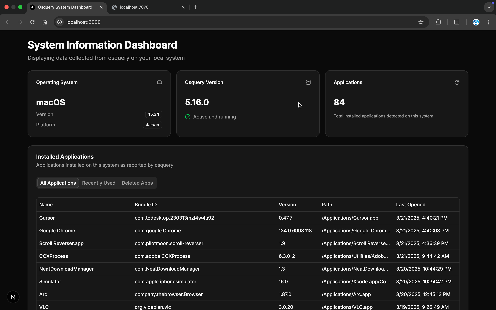
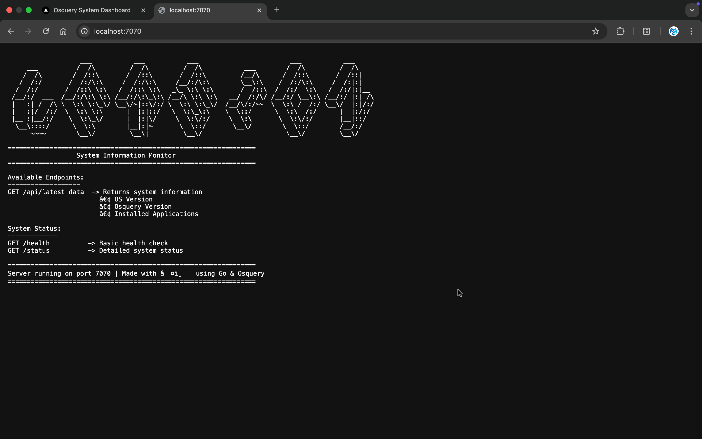
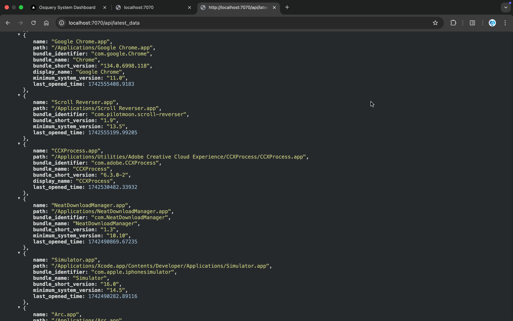
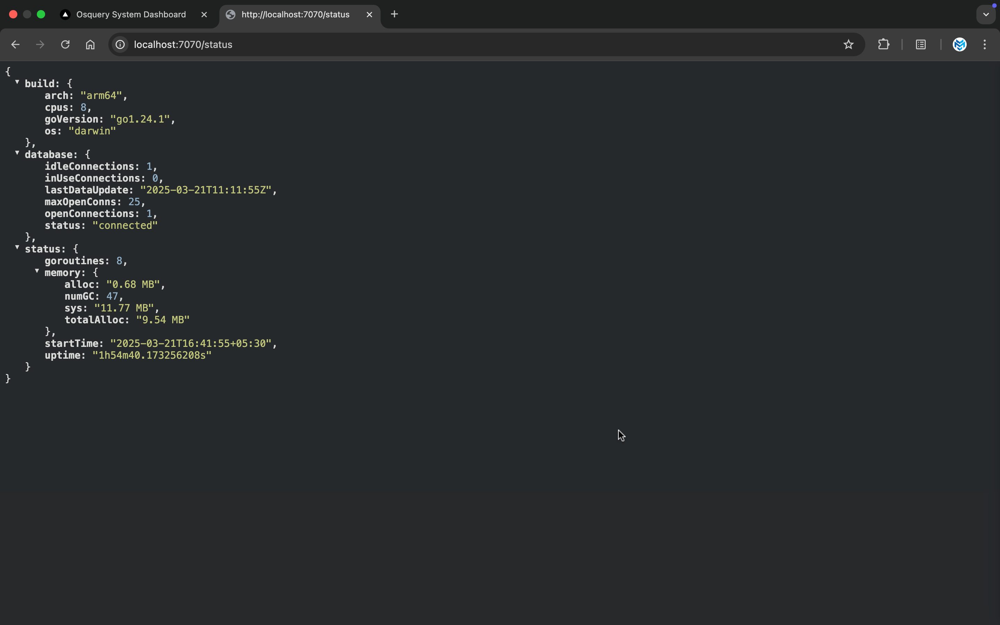
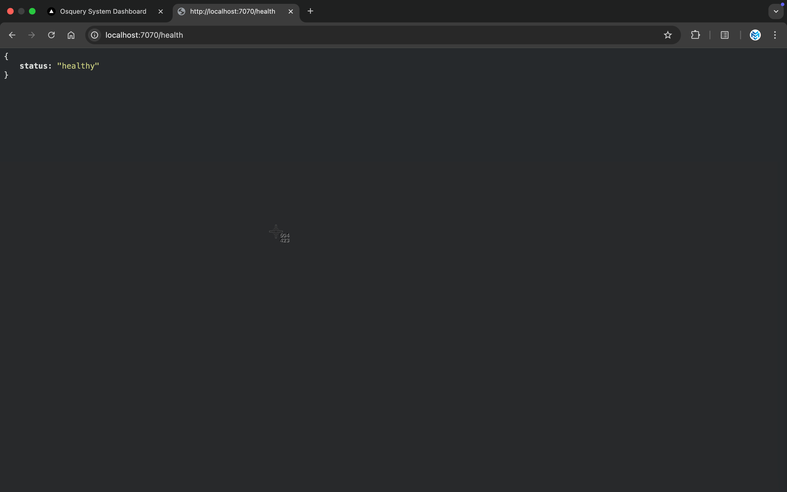
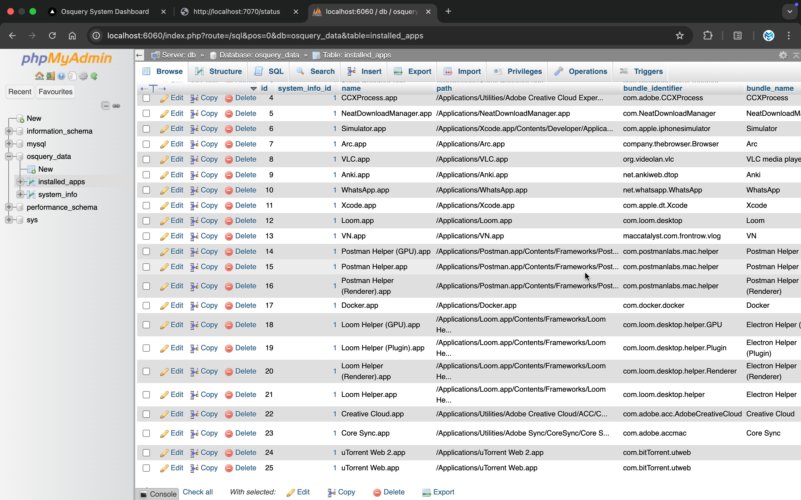

# Version

A full-stack application that collects and displays system information using osquery, featuring a Go backend and Next.js frontend.

## Overview

This project provides real-time system information monitoring through osquery integration. It consists of:
- A Go backend service that interfaces with osquery and manages data storage
- A modern React frontend for data visualization
- MariaDB for persistent storage

## Screenshots

<div align="center">
  <div style="display: grid; grid-template-columns: repeat(2, 1fr); gap: 20px; margin-bottom: 20px;">
    
    
    
    
    
    
  </div>
</div>

Each screenshot shows a key feature of the application:
- **Dashboard View**: Main interface showing system overview
- **API Response**: API response for the latest data
- **Latest Data**: Latest data from the database
- **Status API Response**: Status API response
- **Health API Response**: Health check API response
- **Database**: Database schema

## System Design

### Architecture

```
┌─────────────────┐         ┌──────────────┐         ┌─────────────┐
│    Frontend     │         │   Backend    │         │   Database  │
│    (Next.js)    │ ◄─────► │    (Go)      │ ◄─────► │  (MariaDB)  │
└─────────────────┘         └──────────────┘         └─────────────┘
                                   ▲
                                   │
                                   ▼
                            ┌──────────────┐
                            │   Osquery    │
                            │   Daemon     │
                            └──────────────┘
```

### Data Flow

1. **Data Collection**:
   - Osquery daemon monitors system information
   - Backend service queries osquery via socket
   - Data is processed and stored in MariaDB

2. **Data Storage**:
   - Versioned storage of system information
   - Efficient querying for latest data
   - Historical data tracking

3. **Data Presentation**:
   - REST API exposes data endpoints
   - Frontend fetches and displays real-time updates
   - Error handling and loading states

### Components

#### Backend Service
- Go-based API server
- Osquery integration
- Database management
- Real-time data collection

#### Frontend Application
- Next.js React application
- Real-time data display
- Responsive design
- Error handling

#### Database
- MariaDB for data persistence
- Versioned data storage
- Efficient querying

## Features

- **System Information Collection**:
  - OS Version details
  - Osquery Version
  - Installed Applications list
- **Real-time Updates**:
  - Automatic data refresh
  - Change detection
  - Version tracking
- **Modern UI**:
  - Responsive design
  - Loading states
  - Error handling
- **Monitoring**:
  - Health checks
  - System status
  - Performance metrics

## Prerequisites

- Go 1.21 or later
- Node.js 18.x or later
- Docker and Docker Compose
- Osquery installed
- MacOS or Windows

## Quick Start

1. **Clone the repository**:
```bash
git clone https://github.com/ManobhavSachan/version.git
cd version
```

2. **Install Osquery**:
```bash
# MacOS
brew install osquery

# Windows
choco install osquery
```

3. **Start the Database**:
```bash
cd version-backend
docker-compose up -d
```

4. **Configure Environment**:

Backend (.env):
```env
SERVER_HOST=localhost
SERVER_PORT=7070
DB_HOST=localhost
DB_PORT=3306
DB_USER=osquery
DB_PASSWORD=osquery_password
DB_NAME=osquery_data
OSQUERY_SOCKET=/var/osquery/osquery.em
QUERY_INTERVAL=300
```

Frontend (.env.local):
```env
NEXT_PUBLIC_API_URL=http://localhost:7070
```

5. **Start the Backend**:
```bash
cd version-backend
go run cmd/server/main.go
```

6. **Start the Frontend**:
```bash
cd version-frontend
npm install
npm run dev
```

7. **Access the Application**:
- Frontend: http://localhost:3000
- API: http://localhost:7070
- phpMyAdmin: http://localhost:6060

## API Documentation

### GET /api/latest_data

Returns the most recent system information.

Response:
```json
{
    "os_version": {
        "name": "macOS",
        "version": "14.0.0",
        "platform": "darwin"
    },
    "osquery_version": "5.10.2",
    "installed_apps": [
        {
            "name": "Chrome",
            "path": "/Applications/Google Chrome.app",
            "bundle_identifier": "com.google.Chrome",
            "bundle_name": "Google Chrome",
            "bundle_short_version": "120.0.6099.129",
            "display_name": "Google Chrome",
            "minimum_system_version": "10.13",
            "last_opened_time": 1678901234
        }
    ],
    "last_updated": "2024-03-15T10:30:00Z"
}
```

## Project Structure

```
.
├── version-frontend/          # Frontend application
│   ├── app/                  # Next.js components
│   ├── public/              # Static assets
│   └── styles/             # CSS styles
│
├── version-backend/          # Backend service
│   ├── cmd/                # Entry points
│   ├── internal/           # Private packages
│   ├── pkg/                # Public packages
│   └── scripts/           # Database scripts
│
└── docs/                    # Documentation
```

## Development

### Backend Development

```bash
cd version-backend
go run cmd/server/main.go
```

### Frontend Development

```bash
cd version-frontend
npm run dev
```

### Testing

Backend:
```bash
cd version-backend
go test ./...
```

Frontend:
```bash
cd version-frontend
npm run test
```

## Monitoring

The application provides monitoring endpoints:

- `/health` - Basic health check
- `/status` - Detailed system status
  - Uptime
  - Memory usage
  - Database status
  - Collection timestamps

## Contributing

1. Fork the repository
2. Create your feature branch
3. Commit your changes
4. Push to the branch
5. Create a Pull Request

## License

MIT License